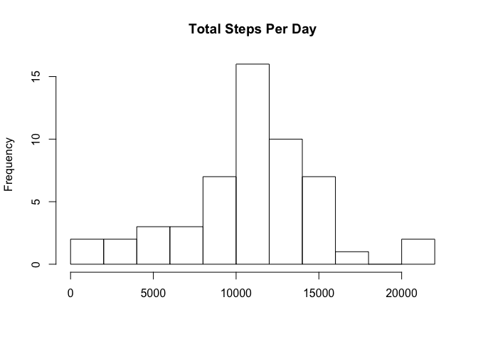
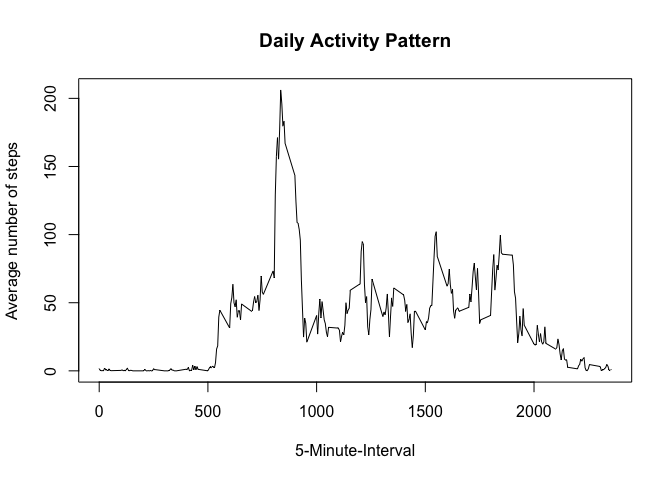
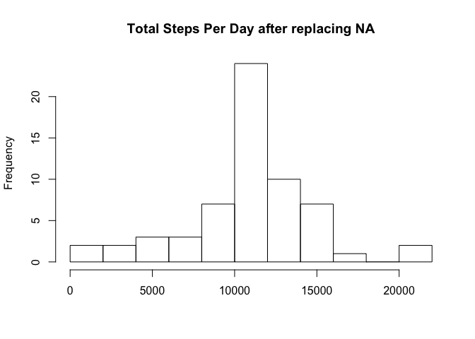
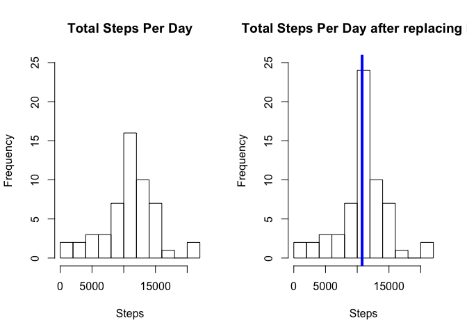
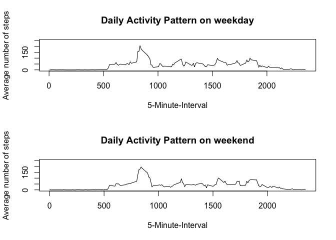

# Reproducible Research: Peer Assessment 1


## Loading and preprocessing the data


```r
activity <- read.csv("activity.csv")
```
* Process/transform the data (if necessary) into a format suitable for your analysis

```{r}.
activity$date <- as.Date(activity$date)
```

## What is mean total number of steps taken per day?

* excluding na


```r
activiy_excludingNA <- activity[which(!is.na(activity$steps)),]
```
* calculating the total steps taken per day


```r
total.steps.by.day <- tapply(activiy_excludingNA$steps, activiy_excludingNA$date, sum)
```
* creating the Historgram

```r
hist(total.steps.by.day,10,main = "Total Steps Per Day", xlab = "")
```

<!-- -->

* 2. Calculate and report the mean and median total number of steps taken per day

        + mean per day

         
         ```r
                 mean.total.steps.by.day <- mean(total.steps.by.day)
         ```
        + median

         
         ```r
                 median.total.steps.by.day <- median(total.steps.by.day)
         ```

## What is the average daily activity pattern?

* Make a time series plot (i.e. type = "l") of the 5-minute interval (x-axis) and the average number of steps taken, averaged across all days (y-axis)


```r
daily_activity <- tapply(activiy_excludingNA$steps, activiy_excludingNA$interval, mean)
```

```r
plot(y = daily_activity, x = names(daily_activity), type = "l", xlab = "5-Minute-Interval", 
     main = "Daily Activity Pattern", ylab = "Average number of steps")
```

<!-- -->
* Which 5-minute interval, on average across all the days in the dataset,contains the maximum number of steps?


```r
max.number.of.steps <- daily_activity[daily_activity==max(daily_activity)]
```

## Imputing missing values
 
* Calculate and report the total number of missing values in the dataset (i.e. the total number of rows with NAs)


```r
sum(is.na(activity))
```

```
## [1] 2304
```
* Devise a strategy for filling in all of the missing values in the dataset. The strategy does not need to be sophisticated. For example, you could use the mean/median for that day, or the mean for that 5-minute interval, etc.


```r
activity.replacing.na <- activity
```
* Create a new dataset that is equal to the original dataset but with the missing data filled in.

```r
activity.replacing.na <- activity

activity.replacing.na[which(is.na(activity.replacing.na$steps)),1] <- 
        daily_activity[as.character(activity.replacing.na[which(is.na(activity.replacing.na$steps)),3])]
```


* Make a histogram of the total number of steps taken each day and Calculate and report the mean and median total number of steps taken per day. Do these values differ from the estimates from the first part of the assignment?

```r
new.total.steps.by.day <- tapply(activity.replacing.na$steps, activity.replacing.na$date, sum)
hist(new.total.steps.by.day,10,main = "Total Steps Per Day after replacing NA", xlab = "")
```

<!-- -->

```r
mean.new.total.steps.by.day <- mean(new.total.steps.by.day)
median.new.total.steps.by.day <- median(new.total.steps.by.day)
```
* comparing the data before removing the NA and after through a graph side by side 

```r
par(mfrow=c(1,2))
hist(total.steps.by.day,10,main = "Total Steps Per Day", xlab = "Steps",ylim = c(0,25))
abline(v= median.total.steps.by.day,col=4,lwd=4)
hist(new.total.steps.by.day,10,main = "Total Steps Per Day after replacing NA", xlab = "Steps",ylim = c(0,25))
abline(v=median.new.total.steps.by.day,col=4,lwd=4)
```

<!-- -->

```r
mean.new.total.steps.by.day - mean.total.steps.by.day
```

```
## [1] NA
```

```r
median.new.total.steps.by.day - median.total.steps.by.day
```

```
## <NA> 
##   NA
```


## Are there differences in activity patterns between weekdays and weekends?


```r
activity.replacing.na$weekday <- weekdays(activity.replacing.na$date)
```

```
## Error in UseMethod("weekdays"): no applicable method for 'weekdays' applied to an object of class "factor"
```

```r
activity.replacing.na$fwd <- as.factor(c("weekend","weekday"))
activity.replacing.na[activity.replacing.na$weekday == "Saturday" | activity.replacing.na$weekday == "Sunday", 5] <- factor("weekend")
activity.replacing.na[!(activity.replacing.na$weekday == "Saturday" | activity.replacing.na$weekday == "Sunday"), 5] <- factor("weekday")
```

```
## Warning in `[<-.factor`(`*tmp*`, iseq, value = structure(c(1L, 1L, 1L,
## 1L, : invalid factor level, NA generated
```

```r
weekday.activity <- subset(activity.replacing.na, fwd=="weekday")
weekend.activity <- subset(activity.replacing.na, fwd=="weekend")
daily_activity_weekdayMean <- tapply(weekday.activity$steps,weekday.activity$interval,mean)
daily_activity_weekendMean <- tapply(weekend.activity$steps,weekend.activity$interval,mean)
par(mfrow=c(2,1))
plot(y = daily_activity_weekdayMean, x = names(daily_activity_weekdayMean), type = "l", xlab = "5-Minute-Interval", 
     main = "Daily Activity Pattern on weekday", ylab = "Average number of steps",ylim = c(0,250))
plot(y = daily_activity_weekendMean, x = names(daily_activity_weekendMean), type = "l", xlab = "5-Minute-Interval", 
     main = "Daily Activity Pattern on weekend", ylab = "Average number of steps",ylim = c(0,250))
```

<!-- -->

